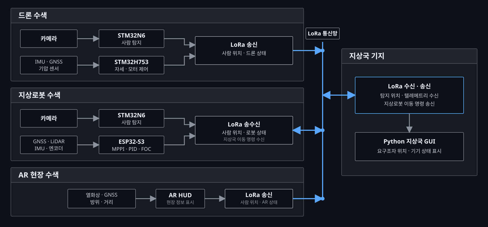

<div align="center">

# ProSearch

**엣지 AI 비전 기반 유무인 복합 및 AR 통합 인명 수색 체계**

2026 한이음 드림업 | 과제번호 `26_HC238` | 팀명 `푸리나와 아이들`

</div>

## 📌 1. 프로젝트 개요

### 1.1 소개

ProSearch는 재난 현장에서 드론, 지상로봇, AR 기기와 지상국을 연동해 요구조자를 수색하는 시스템입니다. 드론에 탑재한 엣지 AI가 영상을 기기 내부에서 분석하고, 탐지 결과와 각 기기의 위치 정보를 LoRa 통신으로 공유합니다. 구조자는 AR HUD로 현장 정보를 확인하고, 지상국은 여러 기기의 상태와 탐지 위치를 한 화면에서 관리합니다.

각 플랫폼은 서로 다른 수색 범위를 담당합니다. 드론은 넓은 구역을 빠르게 확인하고, 지상로봇은 구조자가 바로 접근하기 어려운 지면 구간을 주행하며, AR 기기는 현장 구조자에게 요구조자의 방향과 거리를 제공합니다. 세 장비가 전송한 위치 정보는 지상국 기지에서 하나의 지도와 관제 화면으로 통합됩니다.

### 1.2 개발 배경

재난 현장에서는 통신망이 불안정하거나 서버 연결이 어려울 수 있습니다. 영상 전체를 외부 서버로 전송하는 방식은 통신 상태에 따라 탐지와 대응이 지연될 수 있습니다. ProSearch는 현장 기기에서 직접 추론하고, 장거리 저전력 통신으로 필요한 정보만 전달하도록 구성했습니다.

원본 영상을 계속 전송하는 대신 사람 탐지 여부, 위도·경도, 기기 상태와 같은 핵심 데이터만 공유해 통신량을 줄였습니다. 또한 각 장비가 독립적으로 탐지와 제어를 수행하므로 일부 통신이 지연되더라도 현장 수색과 이동 제어를 이어갈 수 있도록 설계했습니다.

### 1.3 시스템 특징

- **현장 추론:** STM32N6 기반 엣지 AI가 카메라 영상을 분석해 사람을 탐지합니다.
- **복합 수색:** 드론의 공중 시야와 지상로봇의 지상 접근 능력을 함께 활용합니다.
- **분산 통신:** LoRa를 통해 드론, 지상로봇, AR 기기와 지상국 사이의 상태 및 탐지 정보를 교환합니다.
- **현장 정보 제공:** AR HUD에 열화상, 방위, 거리와 좌표 정보를 표시합니다.
- **통합 관제:** Python 기반 지상국 GUI에서 기기 위치, 통신 상태와 탐지 지점을 확인합니다.

### 1.4 주요 기능

| 구분 | 구현 내용 | 상태 |
| --- | --- | --- |
| Edge AI | 카메라 영상 기반 사람 탐지와 탐지 이벤트 출력 | 완료 |
| LoRa 통신 | 기기별 텔레메트리와 탐지 이벤트 교환 | 완료 |
| 드론 자세제어 | 센서 융합, 자세 및 각속도 제어, 모터 출력 혼합 | 완료 |
| 지상로봇 자율주행 | GNSS 경로 추종, LiDAR 장애물 회피, MPPI 및 PID/FOC 제어 | 완료 |
| AR HUD | 열화상, 방위, 거리와 위치 정보 표시 | 완료 |
| 지상국 GUI | 지도, 영상, 기기 상태, 탐지 위치와 통신 품질 표시 | 완료 |

### 1.5 활용 분야

- 붕괴, 화재, 산악 사고 등 사람이 바로 진입하기 어려운 현장의 초동 수색
- 통신 인프라가 제한된 지역의 분산형 수색 및 위치 공유
- 공중과 지상 수색 장비를 함께 운용하는 재난 대응 훈련

### 1.6 기술 구성

| 영역 | 주요 기술 |
| --- | --- |
| 드론 | STM32H753, BNO085, GNSS, BLDC 모터 제어, C |
| Edge AI | STM32N6, B-CAMS 카메라, STM32Cube.AI, YOLO 계열 객체 탐지 |
| 지상로봇 | ESP32-S3, GNSS, LiDAR, MPPI, PID/FOC, C/C++ |
| AR 기기 | STM32, 열화상 카메라, GNSS, 방위 센서, 레이저 거리 측정기 |
| 통신 | LoRa, UART, 자체 메시지 프로토콜 |
| 지상국 | Python, CustomTkinter/Tkinter, OpenCV, tkintermapview, 텔레메트리 시각화 |

<br><br>

## 👥 2. 팀원 소개

<table width="100%">
  <tr>
    <td align="center" width="33%">
      <br>
      <strong>송성혁</strong><br>
      팀장 · 지상로봇 개발
    </td>
    <td align="center" width="33%">
      <br>
      <strong>박규현</strong><br>
      드론 비행제어보드 개발
    </td>
    <td align="center" width="33%">
      <br>
      <strong>임송주</strong><br>
      드론 제어
    </td>
  </tr>
</table>

<table width="100%">
  <tr>
    <td align="center" width="50%">
      <br>
      <strong>홍순현</strong><br>
      지상국 및 기기 간 통신 개발
    </td>
    <td align="center" width="50%">
      <br>
      <strong>김주원</strong><br>
      AR 기기 개발
    </td>
  </tr>
</table>

<br><br>

## 💡 3. 시스템 구성도

<p align="center">
  <a href="docs/images/system-architecture.svg">
    
  </a>
</p>

구조도를 클릭하면 각 장비와 지상국 사이의 데이터 흐름을 원본 크기로 확인할 수 있습니다.

### 3.1 동작 흐름

1. 드론과 지상로봇은 각각 STM32N6에서 카메라 영상을 처리해 사람을 탐지합니다.
2. 드론 비행제어보드는 IMU, GNSS와 기압 센서 정보를 이용해 자세와 모터 출력을 제어합니다.
3. 지상로봇은 GNSS 경로와 LiDAR 장애물 정보를 바탕으로 MPPI 후보 명령열을 평가하고, PID와 FOC를 거쳐 좌우 모터를 제어합니다.
4. 드론, 지상로봇과 AR 기기는 탐지한 사람의 위도·경도를 계산해 LoRa로 지상국 기지에 전송합니다.
5. 지상국 기지는 각 기기의 텔레메트리와 요구조자 위치를 수신해 Python GUI에 표시하고, 지정한 이동 명령을 지상로봇에 다시 전송합니다.
6. AR 기기는 열화상, 방위, 거리와 좌표를 HUD에 표시해 구조자의 현장 판단을 지원합니다.

### 3.2 구현 기기

<table width="100%">
  <tr>
    <td align="center" width="33%">
      <br>
      <strong>드론</strong>
    </td>
    <td align="center" width="33%">
      <br>
      <strong>드론 비행제어보드</strong>
    </td>
    <td align="center" width="33%">
      <br>
      <strong>지상로봇</strong>
    </td>
  </tr>
</table>

<table width="100%">
  <tr>
    <td align="center" width="50%">
      <br>
      <strong>AR 기기</strong>
    </td>
    <td align="center" width="50%">
      <br>
      <strong>지상국 GUI</strong>
    </td>
  </tr>
</table>

<br><br>

## 🎬 4. 작품 소개영상

아래 이미지를 누르면 작품 소개영상으로 이동합니다.

[](https://www.youtube.com/watch?v=uuq3NOce7dk)

<br><br>

## 💻 5. 핵심 소스코드

### 5.1 장비별 핵심 코드

| 대상 장비 | 핵심 기능 | 관련 경로 |
| --- | --- | --- |
| **지상로봇** | MPPI 경로 생성·평가, PID/FOC 기반 좌우 BLDC 모터 제어 | [`ground_station_robot`](ground_station_robot/) |

아래에 소개하는 코드는 모두 **지상로봇에 실제 적용한 핵심 제어 코드**입니다. 드론, Edge AI, AR 기기와 지상국 코드는 디렉터리 구성에서 각각의 경로를 확인할 수 있습니다.

### 5.2 전체 디렉터리 구성

| 경로 | 담당 기능 | 주요 내용 |
| --- | --- | --- |
| [`DRONE`](DRONE/) | 드론 비행제어 | 센서 입력, 자세 및 각속도 제어, 모터 출력 생성 |
| [`N6`](N6/) | Edge AI | 카메라 입력, 사람 탐지 후 제어보드에 탐지 신호 전달 |
| [`TTGO`](TTGO/) | LoRa 지상 통신기 | 기기별 통신 순서 관리, 텔레메트리 및 명령 중계 |
| [`ground_station_robot`](ground_station_robot/) | 지상로봇 | 균형 제어, 경로 추종, LiDAR 기반 장애물 회피 |
| [`Core`](Core/) | AR 기기 | 화면 표시, GNSS, 방위, 거리 측정과 LoRa 통신 |
| [`GUI`](GUI/) | 지상국 | 지도, 영상, 기기 상태와 탐지 정보 표시 |

### 5.3 지상로봇 - dq축 전압의 3상 변환

- **적용 장비:** 지상로봇
- **소스코드 설명:** [`ground_station_robot/encoder.c`](ground_station_robot/encoder.c)는 PID 출력으로 정해진 d·q축 전압을 역 Park 변환으로 α·β축 전압으로 바꿉니다. 이어서 역 Clarke 변환을 적용해 지상로봇 좌우 BLDC 모터의 3상 전압 `Va`, `Vb`, `Vc`를 계산합니다.

```c
float Vq_l = -Vq_left;
float Vq_r = Vq_right;
float Vd = 0.0f;

int pole_pairs = 11;
float ele_angle_l = (angle_l - offset_l) * (float)pole_pairs;
float ele_angle_r = (angle_r - offset_r) * (float)pole_pairs;

// Left motor: inverse Park transform
float V_alpha_l = Vd * cosf(ele_angle_l) - Vq_l * sinf(ele_angle_l);
float V_beta_l  = Vd * sinf(ele_angle_l) + Vq_l * cosf(ele_angle_l);

// Left motor: inverse Clarke transform
float Va_l = V_alpha_l;
float Vb_l = -0.5f * V_alpha_l + (sqrtf(3.0f) / 2.0f) * V_beta_l;
float Vc_l = -0.5f * V_alpha_l - (sqrtf(3.0f) / 2.0f) * V_beta_l;

// Right motor: inverse Park transform
float V_alpha_r = Vd * cosf(ele_angle_r) - Vq_r * sinf(ele_angle_r);
float V_beta_r  = Vd * sinf(ele_angle_r) + Vq_r * cosf(ele_angle_r);

// Right motor: inverse Clarke transform
float Va_r = V_alpha_r;
float Vb_r = -0.5f * V_alpha_r + (sqrtf(3.0f) / 2.0f) * V_beta_r;
float Vc_r = -0.5f * V_alpha_r - (sqrtf(3.0f) / 2.0f) * V_beta_r;
```

### 5.4 지상로봇 - MPPI 후보 명령열 생성

- **적용 장비:** 지상로봇
- **소스코드 설명:** [`ground_station_robot/mppi.c`](ground_station_robot/mppi.c)는 직전 최적 명령열을 한 스텝 앞으로 이동시킨 기준 명령열에서 새로운 후보를 만듭니다. 선속도 `v_ref`와 각속도 `w_ref`에 시간적으로 이어지는 노이즈를 더하고, 허용 범위로 제한해 급격히 끊기지 않는 여러 주행 명령열을 생성합니다. 현재 설정에서는 15스텝 길이의 후보 64개를 매 제어 주기마다 평가합니다.

```c
static void sample_input_sequence_from_base(MPPI_Input *dst,
                                            const MPPI_Input *base,
                                            int horizon)
{
    float v_amp = sequence_initialized ? 0.28f : 0.50f;
    float w_amp = sequence_initialized ? 0.25f : 0.90f;

    float noise_v = rand_symmetric(v_amp);
    float noise_w = rand_symmetric(w_amp);

    for (int t = 0; t < horizon; t++) {
        noise_v = 0.7f * noise_v + 0.3f * rand_symmetric(v_amp);
        noise_w = 0.7f * noise_w + 0.3f * rand_symmetric(w_amp);

        dst[t].v_ref = clampf_local(base[t].v_ref + noise_v,
                                    mppi_params.v_min,
                                    mppi_params.v_max);

        dst[t].w_ref = clampf_local(base[t].w_ref + noise_w,
                                    mppi_params.w_min,
                                    mppi_params.w_max);
    }
}
```

### 5.5 지상로봇 - MPPI 경로 비용 합산

- **적용 장비:** 지상로봇
- **소스코드 설명:** [`ground_station_robot/mppi.c`](ground_station_robot/mppi.c)는 각 후보 제어 입력으로 미래 상태를 예측합니다. 각 시점의 목표 위치, 진행 방향, 장애물, 제어 입력 크기와 입력 변화량 비용을 모두 더해 후보 경로의 총비용을 계산합니다.

```c
static float evaluate_input_sequence(const MPPI_State *start_state,
                                     const MPPI_Input *sequence,
                                     int horizon)
{
    float total_cost = 0.0f;
    MPPI_State pred_state = *start_state;
    MPPI_Input prev_input = prev_applied_input;

    for (int t = 0; t < horizon; t++) {
        pred_state = predict_next_state(&pred_state, &sequence[t]);

        total_cost += calc_goal_cost(&pred_state);
        total_cost += calc_heading_cost(&pred_state);
        total_cost += calc_sector_obstacle_cost(&pred_state, start_state);
        total_cost += calc_input_cost(&sequence[t]);
        total_cost += calc_smooth_cost(&sequence[t], &prev_input);

        prev_input = sequence[t];
    }

    return total_cost;
}
```

### 5.6 지상로봇 - MPPI 제어 흐름

1. 직전 최적 명령열을 한 스텝 이동해 이번 제어 주기의 기준 명령열을 구성합니다.
2. 기준 명령열에 서로 다른 선속도·각속도 노이즈를 더해 64개의 후보 명령열을 생성합니다.
3. 각 후보를 15스텝 동안 예측하며 목표 거리, 진행 방향, 장애물, 입력 크기와 입력 변화량 비용을 합산합니다.
4. 비용이 낮은 후보일수록 큰 가중치를 주고, 모든 후보를 가중 평균해 새로운 최적 명령열을 계산합니다.
5. 최적 명령열의 첫 번째 입력만 현재 주기에 적용하고, 다음 주기에 같은 과정을 반복해 경로 변화와 장애물에 대응합니다.

### 5.7 N6 · GUI · TTGO 개발환경 및 실행 안내

| 구성요소 | 개발환경 및 주요 기술 | 기능 및 실행 문서 |
| --- | --- | --- |
| N6 | C, STM32N657 Neural-ART NPU, YOLOv8n 320×320, STEdgeAI 4.0, CubeIDE 1.17.0 / GCC 12.3.1 | [사람 인식·GPIO 신호·플래시 및 소스 재생성](N6/README.md) |
| GUI | Python 3.12, CustomTkinter/Tkinter, OpenCV, tkintermapview, pyserial, NTRIP | [지도·영상·검출 위치·설치 및 실행](GUI/README.md) |
| TTGO | ESP32, Arduino C++, PlatformIO, LoRa, RTCM3 / CRC24Q, SSD1306 OLED | [통신 중계·패킷·빌드 및 업로드](TTGO/README.md) |

N6에서 사람 신뢰도가 70% 이상이면 Arduino D2(PD0)에 GPIO 펄스를 출력합니다. 로봇 ESP는 이 이벤트에 GPS 좌표와 검출 상태를 결합해 LoRa로 전송하고, TTGO가 PC로 중계하면 GUI가 해당 좌표에 초록색 발견 마커를 표시합니다. 각 구성요소의 역할, 설정값과 확인 절차는 위 README에서 확인할 수 있습니다.
