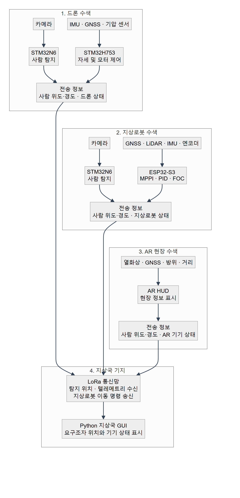

<div align="center">

# ProSearch

**엣지 AI 비전 기반 유무인 복합 및 AR 통합 인명 수색 체계**

2026 한이음 드림업 | 과제번호 `26_HC238` | 팀명 `푸리나와 아이들`

</div>

## 📌 1. 프로젝트 개요

### 1.1 소개

ProSearch는 재난 현장에서 드론, 지상로봇, AR 기기와 지상국을 연동해 요구조자를 수색하는 시스템입니다. 드론에 탑재한 엣지 AI가 영상을 기기 내부에서 분석하고, 탐지 결과와 각 기기의 위치 정보를 LoRa 통신으로 공유합니다. 구조자는 AR HUD로 현장 정보를 확인하고, 지상국은 여러 기기의 상태와 탐지 위치를 한 화면에서 관리합니다.

### 1.2 개발 배경

재난 현장에서는 통신망이 불안정하거나 서버 연결이 어려울 수 있습니다. 영상 전체를 외부 서버로 전송하는 방식은 통신 상태에 따라 탐지와 대응이 지연될 수 있습니다. ProSearch는 현장 기기에서 직접 추론하고, 장거리 저전력 통신으로 필요한 정보만 전달하도록 구성했습니다.

### 1.3 시스템 특징

- **현장 추론:** STM32N6 기반 엣지 AI가 카메라 영상을 분석해 사람을 탐지합니다.
- **복합 수색:** 드론의 공중 시야와 지상로봇의 지상 접근 능력을 함께 활용합니다.
- **분산 통신:** LoRa를 통해 드론, 지상로봇, AR 기기와 지상국 사이의 상태 및 탐지 정보를 교환합니다.
- **현장 정보 제공:** AR HUD에 열화상, 방위, 거리와 좌표 정보를 표시합니다.
- **통합 관제:** Python 기반 지상국 GUI에서 기기 위치, 통신 상태와 탐지 지점을 확인합니다.

### 1.4 주요 기능

| 구분 | 구현 내용 | 상태 |
| --- | --- | --- |
| Edge AI | 카메라 영상 기반 사람 탐지와 탐지 이벤트 출력 | 완료 |
| LoRa 통신 | 기기별 텔레메트리와 탐지 이벤트 교환 | 완료 |
| 드론 자세제어 | 센서 융합, 자세 및 각속도 제어, 모터 출력 혼합 | 완료 |
| 지상로봇 자율주행 | GNSS 경로 추종, LiDAR 장애물 회피, MPPI 및 PID/FOC 제어 | 완료 |
| AR HUD | 열화상, 방위, 거리와 위치 정보 표시 | 완료 |
| 지상국 GUI | 지도, 영상, 기기 상태, 탐지 위치와 통신 품질 표시 | 완료 |

### 1.5 활용 분야

- 붕괴, 화재, 산악 사고 등 사람이 바로 진입하기 어려운 현장의 초동 수색
- 통신 인프라가 제한된 지역의 분산형 수색 및 위치 공유
- 공중과 지상 수색 장비를 함께 운용하는 재난 대응 훈련

### 1.6 기술 구성

| 영역 | 주요 기술 |
| --- | --- |
| 드론 | STM32H753, BNO085, GNSS, BLDC 모터 제어, C |
| Edge AI | STM32N6, B-CAMS 카메라, STM32Cube.AI, YOLO 계열 객체 탐지 |
| 지상로봇 | ESP32-S3, GNSS, LiDAR, MPPI, PID/FOC, C/C++ |
| AR 기기 | STM32, 열화상 카메라, GNSS, 방위 센서, 레이저 거리 측정기 |
| 통신 | LoRa, UART, 자체 메시지 프로토콜 |
| 지상국 | Python, PyQt, 지도 및 텔레메트리 시각화 |

## 👥 2. 팀원 소개

<table width="100%">
  <tr>
    <td align="center" width="33%">
      <br>
      <strong>박규현</strong><br>
      드론 비행제어보드 개발
    </td>
    <td align="center" width="33%">
      <br>
      <strong>임송주</strong><br>
      드론 제어
    </td>
    <td align="center" width="33%">
      <br>
      <strong>송성혁</strong><br>
      팀장 · 지상로봇 개발
    </td>
  </tr>
</table>

<table width="100%">
  <tr>
    <td align="center" width="50%">
      <br>
      <strong>홍순현</strong><br>
      지상국 및 기기 간 통신 개발
    </td>
    <td align="center" width="50%">
      <br>
      <strong>김주원</strong><br>
      AR 기기 개발
    </td>
  </tr>
</table>

## 💡 3. 시스템 구성도

<p align="center">
  <a href="docs/images/system-architecture.png">
    
  </a>
</p>

### 3.1 동작 흐름

1. 드론과 지상로봇은 각각 STM32N6에서 카메라 영상을 처리해 사람을 탐지합니다.
2. 드론, 지상로봇과 AR 기기는 탐지한 사람의 위도·경도를 계산해 LoRa로 지상국 기지에 전송합니다.
3. 지상국 기지는 각 기기의 텔레메트리와 요구조자 위치를 수신해 Python GUI에 표시합니다.
4. 지상국 GUI에서 지정한 지상로봇 이동 명령은 LoRa를 통해 지상로봇 제어기로 전달됩니다.
5. AR 기기는 열화상, 방위, 거리와 좌표를 HUD에 표시해 구조자의 현장 판단을 지원합니다.

### 3.2 구현 기기

<table width="100%">
  <tr>
    <td align="center" width="33%">
      <br>
      <strong>드론</strong>
    </td>
    <td align="center" width="33%">
      <br>
      <strong>드론 비행제어보드</strong>
    </td>
    <td align="center" width="33%">
      <br>
      <strong>지상로봇</strong>
    </td>
  </tr>
</table>

<table width="100%">
  <tr>
    <td align="center" width="50%">
      <br>
      <strong>AR 기기</strong>
    </td>
    <td align="center" width="50%">
      <br>
      <strong>지상국 GUI</strong>
    </td>
  </tr>
</table>

## 🎬 4. 작품 소개영상

아래 이미지를 누르면 작품 소개영상으로 이동합니다.

[](https://www.youtube.com/watch?v=uuq3NOce7dk)

## 💻 5. 핵심 소스코드

### 5.1 디렉터리 구성

| 경로 | 담당 기능 | 주요 내용 |
| --- | --- | --- |
| [`DRONE`](DRONE/) | 드론 비행제어 | 센서 입력, 자세 및 각속도 제어, 모터 출력 생성 |
| [`N6`](N6/) | Edge AI | 카메라 입력, 사람 탐지 후 제어보드에 탐지 신호 전달 |
| [`TTGO`](TTGO/) | LoRa 지상 통신기 | 기기별 통신 순서 관리, 텔레메트리 및 명령 중계 |
| [`ground_station_robot`](ground_station_robot/) | 지상로봇 | 균형 제어, 경로 추종, LiDAR 기반 장애물 회피 |
| [`Core`](Core/) | AR 기기 | 화면 표시, GNSS, 방위, 거리 측정과 LoRa 통신 |
| [`GUI`](GUI/) | 지상국 | 지도, 영상, 기기 상태와 탐지 정보 표시 |

### 5.2 dq축 전압의 3상 변환

- **소스코드 설명:** [`ground_station_robot/encoder.c`](ground_station_robot/encoder.c)는 PID 출력으로 정해진 d·q축 전압을 역 Park 변환으로 α·β축 전압으로 바꿉니다. 이어서 역 Clarke 변환을 적용해 좌우 BLDC 모터의 3상 전압 `Va`, `Vb`, `Vc`를 계산합니다.

```c
float Vq_l = -Vq_left;
float Vq_r = Vq_right;
float Vd = 0.0f;

int pole_pairs = 11;
float ele_angle_l = (angle_l - offset_l) * (float)pole_pairs;
float ele_angle_r = (angle_r - offset_r) * (float)pole_pairs;

// Left motor: inverse Park transform
float V_alpha_l = Vd * cosf(ele_angle_l) - Vq_l * sinf(ele_angle_l);
float V_beta_l  = Vd * sinf(ele_angle_l) + Vq_l * cosf(ele_angle_l);

// Left motor: inverse Clarke transform
float Va_l = V_alpha_l;
float Vb_l = -0.5f * V_alpha_l + (sqrtf(3.0f) / 2.0f) * V_beta_l;
float Vc_l = -0.5f * V_alpha_l - (sqrtf(3.0f) / 2.0f) * V_beta_l;

// Right motor: inverse Park transform
float V_alpha_r = Vd * cosf(ele_angle_r) - Vq_r * sinf(ele_angle_r);
float V_beta_r  = Vd * sinf(ele_angle_r) + Vq_r * cosf(ele_angle_r);

// Right motor: inverse Clarke transform
float Va_r = V_alpha_r;
float Vb_r = -0.5f * V_alpha_r + (sqrtf(3.0f) / 2.0f) * V_beta_r;
float Vc_r = -0.5f * V_alpha_r - (sqrtf(3.0f) / 2.0f) * V_beta_r;
```

### 5.3 MPPI 경로 비용 합산

- **소스코드 설명:** [`ground_station_robot/mppi.c`](ground_station_robot/mppi.c)는 각 후보 제어 입력으로 미래 상태를 예측합니다. 각 시점의 목표 위치, 진행 방향, 장애물, 제어 입력 크기와 입력 변화량 비용을 모두 더해 후보 경로의 총비용을 계산합니다.

```c
static float evaluate_input_sequence(const MPPI_State *start_state,
                                     const MPPI_Input *sequence,
                                     int horizon)
{
    float total_cost = 0.0f;
    MPPI_State pred_state = *start_state;
    MPPI_Input prev_input = prev_applied_input;

    for (int t = 0; t < horizon; t++) {
        pred_state = predict_next_state(&pred_state, &sequence[t]);

        total_cost += calc_goal_cost(&pred_state);
        total_cost += calc_heading_cost(&pred_state);
        total_cost += calc_sector_obstacle_cost(&pred_state, start_state);
        total_cost += calc_input_cost(&sequence[t]);
        total_cost += calc_smooth_cost(&sequence[t], &prev_input);

        prev_input = sequence[t];
    }

    return total_cost;
}
```
