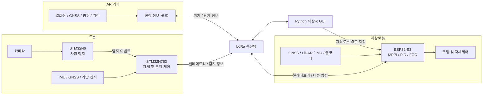
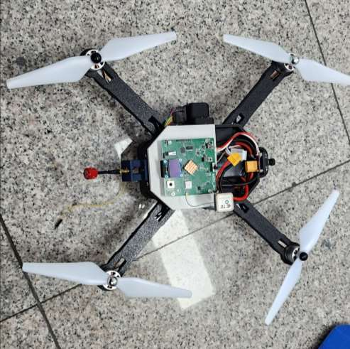
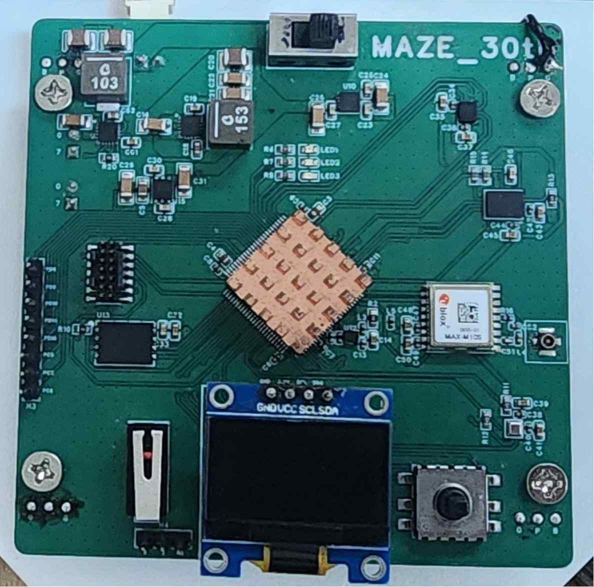
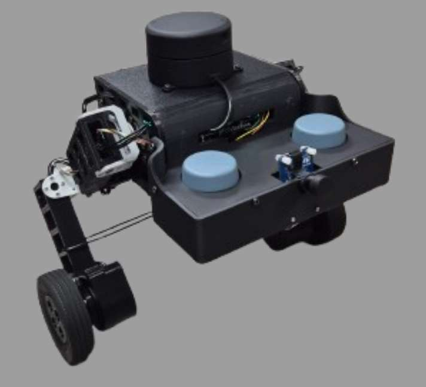
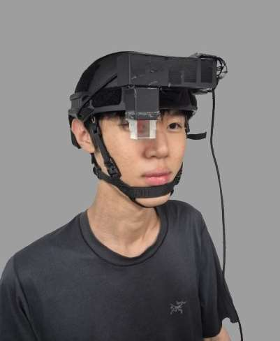
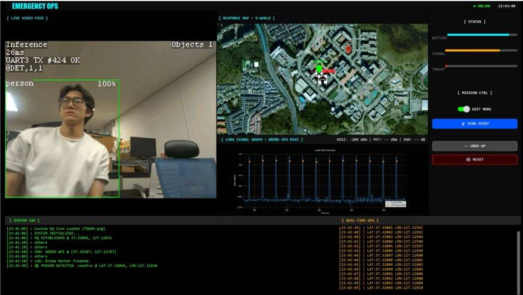

# ProSearch

**엣지 AI 비전 기반 유무인 복합 및 AR 통합 인명 수색 체계**

2026 한이음 드림업 | 과제번호 `26_HC238` | 팀명 `푸리나와 아이들`

## 1. 프로젝트 개요

### 1.1 소개

ProSearch는 재난 현장에서 드론, 지상로봇, AR 기기와 지상국을 연동해 요구조자를 수색하는 시스템입니다. 드론에 탑재한 엣지 AI가 영상을 기기 내부에서 분석하고, 탐지 결과와 각 기기의 위치 정보를 LoRa 통신으로 공유합니다. 구조자는 AR HUD로 현장 정보를 확인하고, 지상국은 여러 기기의 상태와 탐지 위치를 한 화면에서 관리합니다.

### 1.2 개발 배경

재난 현장에서는 통신망이 불안정하거나 서버 연결이 어려울 수 있습니다. 영상 전체를 외부 서버로 전송하는 방식은 통신 상태에 따라 탐지와 대응이 지연될 수 있습니다. ProSearch는 현장 기기에서 직접 추론하고, 장거리 저전력 통신으로 필요한 정보만 전달하도록 구성했습니다.

### 1.3 시스템 특징

- **현장 추론:** STM32N6 기반 엣지 AI가 카메라 영상을 분석해 사람을 탐지합니다.
- **복합 수색:** 드론의 공중 시야와 지상로봇의 지상 접근 능력을 함께 활용합니다.
- **분산 통신:** LoRa를 통해 드론, 지상로봇, AR 기기와 지상국 사이의 상태 및 탐지 정보를 교환합니다.
- **현장 정보 제공:** AR HUD에 열화상, 방위, 거리와 좌표 정보를 표시합니다.
- **통합 관제:** Python 기반 지상국 GUI에서 기기 위치, 통신 상태와 탐지 지점을 확인합니다.

### 1.4 주요 기능

| 구분 | 구현 내용 | 상태 |
| --- | --- | --- |
| Edge AI | 카메라 영상 기반 사람 탐지와 탐지 이벤트 출력 | 완료 |
| LoRa 통신 | 기기별 텔레메트리와 탐지 이벤트 교환 | 완료 |
| 드론 자세제어 | 센서 융합, 자세 및 각속도 제어, 모터 출력 혼합 | 완료 |
| 지상로봇 자율주행 | GNSS 경로 추종, LiDAR 장애물 회피, MPPI 및 PID/FOC 제어 | 완료 |
| AR HUD | 열화상, 방위, 거리와 위치 정보 표시 | 완료 |
| 지상국 GUI | 지도, 영상, 기기 상태, 탐지 위치와 통신 품질 표시 | 완료 |

### 1.5 활용 분야

- 붕괴, 화재, 산악 사고 등 사람이 바로 진입하기 어려운 현장의 초동 수색
- 통신 인프라가 제한된 지역의 분산형 수색 및 위치 공유
- 공중과 지상 수색 장비를 함께 운용하는 재난 대응 훈련

### 1.6 기술 구성

| 영역 | 주요 기술 |
| --- | --- |
| 드론 | STM32H753, BNO085, GNSS, BLDC 모터 제어, C |
| Edge AI | STM32N6, B-CAMS 카메라, STM32Cube.AI, YOLO 계열 객체 탐지 |
| 지상로봇 | ESP32-S3, GNSS, LiDAR, MPPI, PID/FOC, C/C++ |
| AR 기기 | STM32, 열화상 카메라, GNSS, 방위 센서, 레이저 거리 측정기 |
| 통신 | LoRa, UART, 자체 메시지 프로토콜 |
| 지상국 | Python, PyQt, 지도 및 텔레메트리 시각화 |

## 2. 팀원 소개

<table>
  <tr>
    <td align="center"></td>
    <td align="center"></td>
    <td align="center"></td>
    <td align="center"></td>
    <td align="center"></td>
  </tr>
  <tr>
    <th align="center">박규현</th>
    <th align="center">임송주</th>
    <th align="center">송성혁</th>
    <th align="center">홍순현</th>
    <th align="center">김주원</th>
  </tr>
  <tr>
    <td align="center">드론 비행제어보드 개발</td>
    <td align="center">드론 제어</td>
    <td align="center">팀장 지상로봇 개발</td>
    <td align="center">지상국 개발 기기 간 통신 개발</td>
    <td align="center">AR 기기 개발</td>
  </tr>
</table>

## 3. 시스템 구성도

### 3.1 동작 흐름

1. 드론 카메라 영상은 STM32N6에서 처리되며, 사람이 탐지되면 이벤트를 비행제어부로 전달합니다.
2. 드론과 지상로봇은 센서 데이터를 이용해 자세와 이동을 제어하고 텔레메트리를 생성합니다.
3. LoRa 통신망은 탐지 결과, 위치, 기기 상태와 지상로봇 이동 명령을 교환합니다.
4. 지상국 GUI는 기기 위치와 탐지 지점을 지도에 표시하고 통신 상태를 시각화합니다.
5. AR 기기는 구조자에게 열화상, 방위, 거리와 좌표 정보를 HUD로 제공합니다.

### 3.2 구현 기기

<table>
  <tr>
    <td align="center"></td>
    <td align="center"></td>
    <td align="center"></td>
  </tr>
  <tr>
    <th align="center">드론</th>
    <th align="center">드론 비행제어보드</th>
    <th align="center">지상로봇</th>
  </tr>
  <tr>
    <td align="center"></td>
    <td align="center"></td>
    <td></td>
  </tr>
  <tr>
    <th align="center">AR 기기</th>
    <th align="center">지상국 GUI</th>
    <th></th>
  </tr>
</table>

## 4. 작품 소개영상

아래 이미지를 누르면 작품 소개영상으로 이동합니다.

## 5. 핵심 소스코드

### 5.1 디렉터리 구성

| 경로 | 담당 기능 | 주요 내용 |
| --- | --- | --- |
| [`DRONE`](DRONE/) | 드론 비행제어 | 센서 입력, 자세 및 각속도 제어, 모터 출력 생성 |
| [`N6`](N6/) | Edge AI | 카메라 입력, 사람 탐지 후 제어보드에 탐지 신호 전달 |
| [`TTGO`](TTGO/) | LoRa 지상 통신기 | 기기별 통신 순서 관리, 텔레메트리 및 명령 중계 |
| [`ground_station_robot`](ground_station_robot/) | 지상로봇 | 균형 제어, 경로 추종, LiDAR 기반 장애물 회피 |
| [`Core`](Core/) | AR 기기 | 화면 표시, GNSS, 방위, 거리 측정과 LoRa 통신 |
| [`GUI`](GUI/) | 지상국 | 지도, 영상, 기기 상태와 탐지 정보 표시 |

### 5.2 주요 구현

#### 드론 자세제어

- [`DRONE/Core/Src/motor.c`](DRONE/Core/Src/motor.c)는 자세 오차와 각속도 오차를 단계적으로 보정하고, roll·pitch·yaw 제어값을 네 개 모터 출력으로 변환합니다.
- [`DRONE/Core/Src/bno085.c`](DRONE/Core/Src/bno085.c)는 BNO085 회전 벡터를 수신해 비행 제어에 필요한 자세 정보를 제공합니다.
- [`DRONE/Core/Src/gnss.c`](DRONE/Core/Src/gnss.c)는 UBX NAV-PVT 메시지에서 위치, 속도와 시간 정보를 해석합니다.

#### Edge AI 사람 탐지

- [`N6/src/main.c`](N6/src/main.c)는 신경망 출력 후처리와 사람 판정을 수행합니다. 같은 대상이 계속 보일 때 탐지 신호가 반복되지 않도록 상태를 유지하고, 새로운 탐지 시 제어보드로 펄스 신호를 보냅니다.
- 모델 플래시와 펌웨어 빌드 절차는 [`N6/README.md`](N6/README.md)에 정리했습니다.

#### LoRa 통신

- [`TTGO/include/master_scheduler.h`](TTGO/include/master_scheduler.h)는 반이중 LoRa 채널에서 지상로봇 보정정보 전송, 응답 수신과 드론 상태 확인 순서를 상태 머신으로 관리합니다.
- 메시지 종류와 통신기 빌드 방법은 [`TTGO/README.md`](TTGO/README.md)에 정리했습니다.

#### 지상로봇 자율주행

- [`ground_station_robot/mppi.c`](ground_station_robot/mppi.c)는 다수의 제어 입력을 예측해 경로 오차, 자세 안정성과 LiDAR 장애물 거리를 함께 평가합니다.
- [`ground_station_robot/waypoint.c`](ground_station_robot/waypoint.c)는 전달받은 경유점을 순서대로 관리하고 도착 여부를 판단합니다.
- [`ground_station_robot/pid.c`](ground_station_robot/pid.c)는 속도, 자세와 방향 제어에 사용하는 PID 계산을 담당합니다.

#### AR HUD

- [`Core/Src/main.c`](Core/Src/main.c)는 화면, GNSS, 방위 센서와 거리 측정기의 입력을 결합해 현장 정보를 표시합니다.
- [`Core/Src/lora.c`](Core/Src/lora.c)는 디스플레이와 공유하는 SPI 버스를 전환하면서 LoRa 송수신을 처리합니다.
- [`Core/Src/gps_neo_m8n.c`](Core/Src/gps_neo_m8n.c)와 [`Core/Src/lrf.c`](Core/Src/lrf.c)는 각각 위치 문장 해석과 레이저 거리 측정을 담당합니다.

#### 지상국 GUI

- [`GUI/guitest.py`](GUI/guitest.py)는 지도, 카메라 화면, 드론·지상로봇 위치, 사람 탐지 지점과 통신 품질을 한 화면에 표시합니다.
- [`GUI/ground_protocol.py`](GUI/ground_protocol.py)는 LoRa로 수신한 드론 및 지상로봇 텔레메트리를 GUI가 사용할 수 있는 데이터로 변환합니다.
- 실행 환경과 설치 방법은 [`GUI/README.md`](GUI/README.md)에 정리했습니다.
